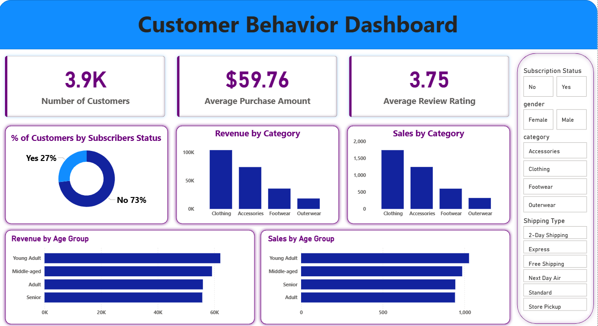

# Customer-Shopping-Behavior-Analysis
A complete end-to-end Data Analytics project using SQL, Python, and Power BI to analyze customer purchase behavior, identify trends, and generate actionable insights.

## 📌 Overview
This project analyzes customer shopping behavior using transactional and customer-level data.
It focuses on revenue trends, purchase preferences, discounts, customer segments, product performance, and the impact of subscription/loyalty factors.

The workflow includes:
- Data Cleaning & Preprocessing (Python)
- Business Problem Solving using SQL
- Dashboard Creation in Power BI
- Insight Generation

---

## 🎯 Objective
- Clean and prepare raw customer dataset using Python  
- Analyze customer purchase behavior using SQL  
- Build an interactive dashboard in Power BI  
- Identify key revenue drivers and customer segments  
- Provide actionable insights for business optimization  

---

## 📁 Dataset
The dataset contains customer shopping information including:
- Customer demographics (age, gender)  
- Purchase amount  
- Product category  
- Item purchased  
- Review rating  
- Shipping type  
- Discount applied  
- Subscription status  
- Previous purchases

---

## 🛠️ Tools & Technologies

### **Programming & Data Cleaning**
- Python  
- Pandas  

### **Database & Querying**
- MySQL (SQL queries)

### **Visualization**
- Power BI

---

## 📂 Project Files
| File | Description |
|------|-------------|
| `Customer Shopping Behavior.ipynb` | Python notebook used for data cleaning |
| `Customer Shopping Behavior.sql` | SQL queries for business analysis |
| `Customer Behavior Dashboard.pbix` | Power BI dashboard |
| `Customer_Behavior_Dashboard.png` | Preview image of the dashboard |
| `README.md` | Project documentation |

---

## 🧹 Steps Performed (Data Pipeline)

### **1️⃣ Python — Data Cleaning**
- Imported dataset using Pandas  
- Removed invalid records  
- Handled missing values  
- Cleaned inconsistent values   
- Standardized categorical labels  
- Prepared cleaned dataset for SQL & Power BI  

### **2️⃣ SQL — Data Analysis**
- Aggregations  
- CTEs  
- Window functions  
- CASE statements  
- Subqueries  
- Revenue, sales, and customer behavior analysis 

### **3️⃣ Power BI — Dashboard Development**
- Imported cleaned dataset  
- Created KPIs (Total Customers, Avg Purchase Amount, Avg Rating)  
- Built charts & visuals (bar, donut, horizontal bar)  
- Added slicers for category, gender, subscription, shipping type  
- Designed a clean, business-oriented dashboard layout  

---

## 📊 Visualizations

### Dashboard Includes:
- **Total Customers**  
- **Average Purchase Amount**  
- **Average Review Rating**  
- **% Customers by Subscription Status (Donut Chart)**  
- **Revenue by Category (Bar Chart)**  
- **Sales by Category (Bar Chart)**  
- **Revenue by Age Group (Horizontal Bar)**  
- **Sales by Age Group (Horizontal Bar)**  
- **Filters:**  
  - Gender  
  - Subscription Status  
  - Category  
  - Shipping Type  
  
## 📸 Dashboard Preview

---

## 🔍 Key Insights

- Clothing is the highest revenue-generating category  
- Young Adults contribute the most revenue  
- Subscribers spend more on average than non-subscribers  
- Express Shipping users tend to spend more  
- Returning and loyal customers generate higher revenue  
- Majority of customers are not subscribed  
- Accessories are the second-highest performing category  

---

## 📈 Outcomes

- A fully cleaned, structured dataset ready for analysis  
- SQL-based insights for actionable decision-making  
- Interactive Power BI dashboard for stakeholders  
- Understanding of customer demographics & spending behavior  
- Ability to identify high-value customer segments  
- Improved clarity for marketing and sales strategies  

---

## 👨‍💻 Author
**Rohit Wagh**  
- 📧 Email: [rohitwagh6264@gmail.com](mailto:rohitwagh6264@gmail.com)
